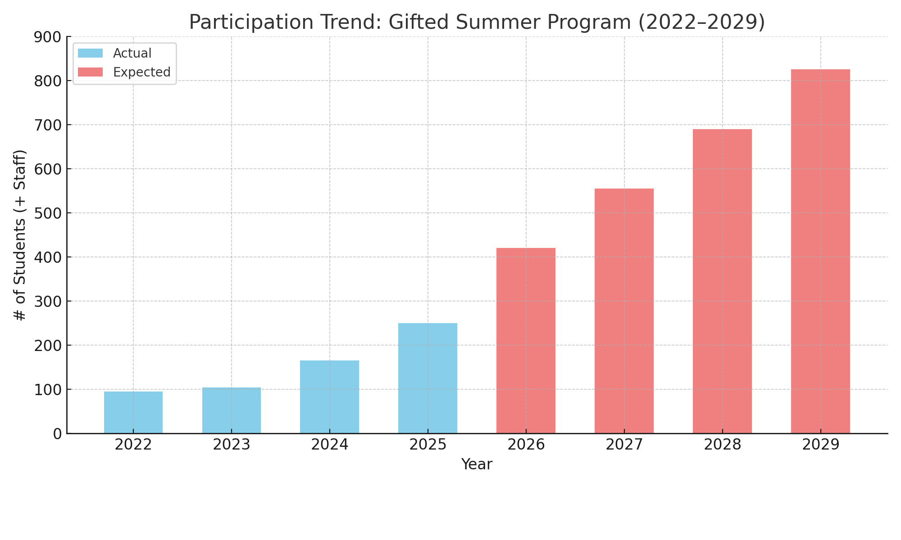

# GenWise @ MAHE
### 2025 and Beyond
*Shaping India's Gifted Future Together*

<!-- presenter: Open with thanks and excitement. Acknowledge MAHE’s visionary leadership and long-standing support. Frame this as a celebration and a peek into what’s next. -->

---

# The Journey So Far
- 2017: First residential Gifted Summer Program at Manipal
- Post-COVID recovery: 
  - 2022:  95
  - 2023: 104
  - 2024: 165
  - 2025: 250 (largest program yet)
- 4:1 student-staff ratio
- MAHE Vision/ Leadership
- MAHE World Class Infrastructure (Experts, Room, Board, Classroom and other infrastructure)

<!-- presenter: Emphasize growth and resilience post-COVID. Reinforce MAHE’s active and continuing role - Infra, food, AC classrooms, faculty engagement, Addas (Emergency Medicine: Dr Mark, Culinary: Chef XYZ, Engineering: ). Mention student-staff ratio as an indicator of program quality. -->

---

# Expanding Our Impact
- **Residential Gifted Programs** (Core)
- **Online Programs** (year-round)
- **Teacher Mentoring** (STEM focus)
- **Now a founding member of Gifted World** (w/ Ei & Center for Talent Dev @ Northwestern)
- **Olympiads** (launching 2025)
- **School Counselor Summits**

<!-- presenter: Show how GenWise is evolving into a full-spectrum gifted ecosystem. Briefly describe each offering to convey credibility and breadth. -->

---

# Strategic Alignment with MAHE
- Early exposure to MAHE campus, infrastructure, faculty
- Opportunity to attract the brightest school students
- Brand-building + long-term pipeline development
- MAHE as hub for thought leadership in gifted education
- Serving less privileged segments

<!-- presenter: Highlight alignment with MAHE’s goals—branding, outreach, and long-term talent cultivation. -->

---

# Looking Ahead
### Scaling Sustainably (2026–2029)

- 350+ students across May-June-July 2026
- MAHE Bengaluru has blessed the June Programs; May/ July at Manipal
- Scale the PATHFINDER Program
- Focus on academic depth, sustained alumni support, & international collaboration
- Making significant investments in staffing & outreach to scale effectively
- Expansion for **Gifted Summer Programs**, and into **Teacher Mentoring** and **GenAI programs** will stretch resources materially

---

<!-- presenter: Lay out a bold but feasible roadmap. Call out Gifted World affiliation as strategic credibility. Mention resource pressure to hint at why MAHE support matters more now. -->

---

# GenWise Under Financial Strain
### No surplus projected for 2025
- Founders have not taken a single rupee since 2017
- Investing for growth
- Merit/ Need-based scholarships to the tune of Rs 40 lacs in 2025
- **Could we revisit pricing framework** to enable scale & access?

<!-- presenter: Use this as a prompt for conversation—not a direct ask. Present as “opportunities for deeper partnership.” -->
---

# Pricing Framework
### Current
- We thank MAHE for offering students this fantastic experience **at cost**
- Rs 2200 per day per person, for up to 150 persons; Rs 1900 per day per person, if we cross this number

### Our Humble Request
- As we scale from 165 (2024) to 800+ (2029), we request your consideration to review this to a (Fixed + Variable) model

<!-- presenter: Use this as a prompt for conversation—not a direct ask. Present as “opportunities for deeper partnership.” -->

---
# Thank You
### With Gratitude for the Ongoing Partnership
Let’s shape the future, together.

<!-- presenter: Close on a note of appreciation and shared vision. Leave room for questions and next steps. -->

---
# Merit, Equity and Inclusion
- **Merit Scholarships**, funded by GenWise
  - 20 Full
  - 30 Half
- **Navodaya Girl Scholarships**
  - 20 Fully sponsored (need-based), by Godrej Foundation and GenWise
- Committed to expanding reach to underserved excellence

<!-- presenter: Underscore that scale doesn’t come at the cost of equity. Mention scholarships as proof of mission-driven intent. -->